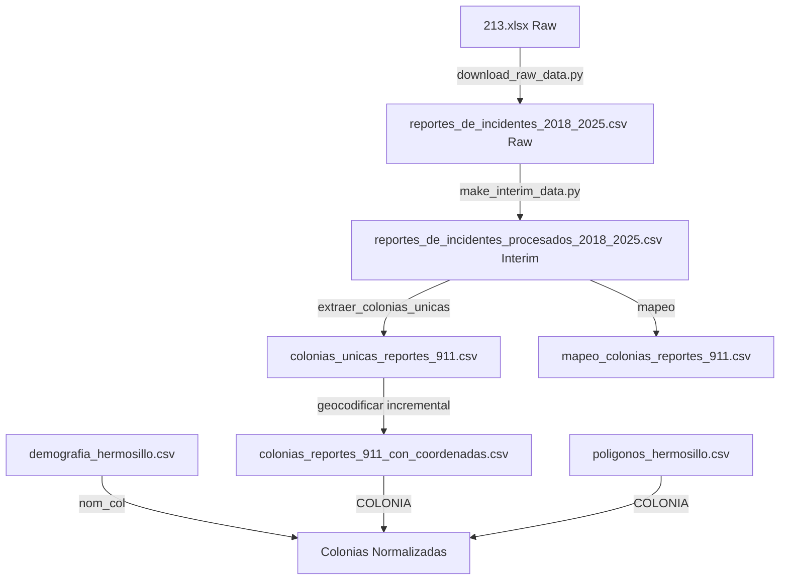

# 📖 Diccionario de Datos
## Proyecto: Índice Delictivo Hermosillo

**Fecha de actualización**: 10 de noviembre de 2025  
**Versión**: 3.0  

---

## 📊 Resumen de Datasets

| Dataset | Archivo | Registros | Columnas | Fuente |
|---------|---------|-----------|----------|--------|
| Reportes 911 (Raw) | `213.xlsx` | 2,297,081 | 8 hojas (2018-2025) | Sistema de Emergencias 911 |
| Reportes 911 (Procesado) | `reportes_de_incidentes_procesados_2018_2025.csv` | 2,297,081 | 10 | Pipeline de procesamiento |
| Demografía | `demografia_hermosillo.csv` | 660 | 11 | INEGI Censo 2020 |
| Polígonos | `poligonos_hermosillo.csv` | ~700 | 32 | Shapefile INE_Limpio (Sonora-en-Datos) |
| Colonias Geocodificadas | `colonias_reportes_911_con_coordenadas.csv` | 2,047 | 8 | Google Maps API |

---

## 📞 Dataset: Reportes a Servicios de Emergencia (Raw)

### Archivo: 213.xlsx

### Descripción General
Registro de incidentes reportados al sistema de emergencias 911 en Hermosillo, Sonora. Dataset multi-hoja con datos de 2018 a 2025. Contiene información sobre el tipo de incidente, ubicación (colonia), fecha y hora del reporte.

### Estructura del Archivo
- **Formato**: Excel (.xlsx) - 8 hojas (una por año)
- **Encoding**: UTF-8
- **Total de registros**: 2,297,081
- **Período temporal**: 2018-01-01 a 2025-09-30
- **Fuente**: Hugging Face dataset `Marcelinux/llamadas911_colonias_hermosillo_2018_2025`

### Columnas

#### 1. COLONIA
- **Tipo**: Texto (String)
- **Descripción**: Nombre de la colonia donde ocurrió el incidente
- **Formato**: MAYÚSCULAS
- **Valores nulos**: No permitidos
- **Observaciones**: 
  - Contiene múltiples variantes ortográficas de la misma colonia
  - 2,296 valores únicos originales
  - 2,047 valores únicos después de normalización (ver archivo procesado)
- **Ejemplos**:
  ```
  10 DE MAYO
  QUINTA ESMERALDA
  LÓPEZ PORTILLO
  VILLAS DEL CORTES
  ```

#### 2. TIPO DE INCIDENTE
- **Tipo**: Texto (String)
- **Descripción**: Clasificación del tipo de incidente reportado
- **Formato**: MAYÚSCULAS
- **Valores nulos**: No permitidos
- **Categorías principales**:
  - Delitos contra la seguridad pública
  - Apoyo a la ciudadanía
  - Violencia familiar
  - Delitos contra el patrimonio
  - Incidentes de tránsito
- **Ejemplos**:
  ```
  PORTACIÓN DE ARMAS O CARTUCHOS
  PERSONA AGRESIVA
  APOYO A LA CIUDADANÍA
  ALLANAMIENTO DE MORADA
  VEHÍCULO A EXCESO DE VELOCIDAD
  ```

#### 3. FECHA
- **Tipo**: Fecha (Date)
- **Descripción**: Fecha en que ocurrió el incidente
- **Formato**: `YYYY-MM-DD` (ISO 8601)
- **Valores nulos**: No permitidos
- **Rango**: 2018-01-01 a 2024-12-31 (aproximado)
- **Ejemplos**:
  ```
  2018-07-30
  2018-11-16
  2018-01-29
  2018-03-12
  ```

#### 4. HORA
- **Tipo**: Entero (Integer)
- **Descripción**: Hora del día en que ocurrió el incidente (formato 24 horas)
- **Formato**: Número entero de 0 a 23
- **Valores nulos**: No permitidos
- **Rango**: 0-23 (donde 0 = 00:00-00:59, 23 = 23:00-23:59)
- **Ejemplos**:
  ```
  22  (10:00 PM - 10:59 PM)
  7   (7:00 AM - 7:59 AM)
  9   (9:00 AM - 9:59 AM)
  4   (4:00 AM - 4:59 AM)
  ```

### Calidad de Datos

| Aspecto | Evaluación | Detalle |
|---------|------------|---------|
| Completitud | ⭐⭐⭐⭐ | Pocas columnas faltantes |
| Precisión | ⭐⭐⭐ | Errores ortográficos en COLONIA |
| Consistencia | ⭐⭐⭐ | Múltiples variantes de nombres |
| Actualidad | ⭐⭐⭐⭐⭐ | Datos actuales (hasta septiembre 2025) |

### Limitaciones Conocidas
1. **Errores ortográficos**: 220 grupos de colonias con variantes (9.8% del total)
2. **Nombres inconsistentes**: Uso irregular de acentos, espacios y mayúsculas
3. **Precisión geográfica**: Solo indica colonia, no dirección exacta
4. **Granularidad temporal**: Hora redondeada (sin minutos/segundos)
5. **Tipos de incidentes**: 475 variantes de nombres necesitan estandarización

---

## 📊 Dataset: Reportes Procesados (Interim)

### Archivo: reportes_de_incidentes_procesados_2018_2025.csv

### Descripción General
Dataset consolidado y procesado de todos los incidentes 2018-2025 con estandarización de tipos de incidentes, categorización y feature engineering temporal. Este archivo es el resultado del pipeline de procesamiento y la fuente principal para análisis avanzados.

### Estructura del Archivo
- **Formato**: CSV (Comma-Separated Values)
- **Encoding**: UTF-8 con BOM (utf-8-sig)
- **Separador**: Coma (`,`)
- **Total de registros**: 2,297,081
- **Tamaño**: ~310 MB
- **Período temporal**: 2018-01-01 00:00:00 a 2025-09-30 23:00:00
- **Pipeline**: `download_raw_data.py` → `make_interim_data.py`

### Columnas

#### 1. COLONIA
- **Tipo**: Texto (String)
- **Descripción**: Nombre de la colonia donde ocurrió el incidente (sin normalización de variantes)
- **Formato**: MAYÚSCULAS
- **Valores nulos**: No permitidos
- **Valores únicos**: 2,296 (antes de normalización)
- **Nota**: Para análisis, usar archivo de mapeo para normalizar

#### 2. TIPO DE INCIDENTE
- **Tipo**: Texto (String)
- **Descripción**: Tipo de incidente ESTANDARIZADO mediante mapeo de 475→198 categorías
- **Formato**: MAYÚSCULAS
- **Valores nulos**: No permitidos
- **Valores únicos**: 198 tipos estandarizados
- **Proceso**: Aplicación de `MAPA_DE_INCIDENTES` con 475 reglas de normalización
- **Ejemplos**:
  ```
  APOYO A LA CIUDADANÍA
  PERSONA AGRESIVA
  PORTACIÓN DE ARMAS O CARTUCHOS
  ALLANAMIENTO DE MORADA
  VEHÍCULO A EXCESO DE VELOCIDAD
  ```
- **Nota**: 7 registros con tipos no mapeados mantienen valor original

#### 3. Timestamp
- **Tipo**: Datetime
- **Descripción**: Fecha y hora exacta del incidente (consolidada)
- **Formato**: `YYYY-MM-DD HH:00:00` (ISO 8601)
- **Valores nulos**: No permitidos
- **Rango**: 2018-01-01 00:00:00 a 2025-09-30 23:00:00
- **Nota**: Reemplaza las columnas FECHA, HORA y Año_Reporte redundantes
- **Ejemplos**:
  ```
  2018-07-30 22:00:00
  2018-11-16 07:00:00
  2025-09-30 23:00:00
  ```

#### 4. ParteDelDia
- **Tipo**: Texto (String) - Categoría
- **Descripción**: Parte del día en que ocurrió el incidente (binning temporal)
- **Valores posibles**:
  - `Madrugada`: 00:00-05:59
  - `Mañana`: 06:00-11:59
  - `Tarde`: 12:00-17:59
  - `Noche`: 18:00-23:59
- **Valores nulos**: No permitidos
- **Generación**: `pd.cut()` sobre `Timestamp.hour`
- **Uso**: Análisis de patrones temporales diarios

#### 5. DiaDeLaSemana
- **Tipo**: Texto (String)
- **Descripción**: Día de la semana en español
- **Valores posibles**: Lunes, Martes, Miércoles, Jueves, Viernes, Sábado, Domingo
- **Valores nulos**: No permitidos
- **Generación**: Mapeo de `Timestamp.dayofweek` (0-6)
- **Uso**: Análisis de patrones semanales

#### 6. EsFinDeSemana
- **Tipo**: Booleano (String: "Sí"/"No")
- **Descripción**: Indicador de si el incidente ocurrió en fin de semana
- **Valores posibles**: 
  - `Sí`: Sábado o Domingo
  - `No`: Lunes a Viernes
- **Valores nulos**: No permitidos
- **Uso**: Segmentación rápida fin de semana vs días laborales

#### 7. Mes
- **Tipo**: Entero (Integer)
- **Descripción**: Mes del año en que ocurrió el incidente
- **Formato**: 1-12 (1=Enero, 12=Diciembre)
- **Valores nulos**: No permitidos
- **Generación**: `Timestamp.month`
- **Uso**: Análisis de estacionalidad

#### 8. EsQuincena
- **Tipo**: Booleano (String: "Sí"/"No")
- **Descripción**: Indicador de si el incidente ocurrió en días de quincena
- **Valores posibles**:
  - `Sí`: Días 1, 14, 15, 16, 28, 29, 30, 31 del mes
  - `No`: Resto de días
- **Valores nulos**: No permitidos
- **Uso**: Análisis de patrones relacionados con períodos de pago

#### 9. Categoria_Incidente
- **Tipo**: Texto (String) - Categoría
- **Descripción**: Categoría de alto nivel del incidente (12 categorías principales)
- **Valores posibles**:
  ```
  Violencia y Agresión
  Tránsito y Vehículos
  Apoyo Ciudadano
  Delitos Patrimoniales
  Alteración del Orden
  Sospechosos y Vigilancia
  Menores y Familia
  Armas y Objetos Peligrosos
  Emergencias Médicas
  Fenómenos Naturales
  Espacios Públicos
  Otros
  ```
- **Valores nulos**: No permitidos (asigna "Otros" si no hay match)
- **Proceso**: Aplicación de `CATEGORIAS_INCIDENTES` con 216 reglas de mapeo
- **Uso**: Agrupación macro para dashboards y análisis estratégicos

#### 10. Nivel_Severidad
- **Tipo**: Texto (String) - Categoría ordinal
- **Descripción**: Nivel de gravedad del incidente
- **Valores posibles**:
  - `ALTA`: Incidentes graves (ej: portación de armas, agresión con arma)
  - `MEDIA`: Incidentes moderados (ej: persona agresiva, vehículo sospechoso)
  - `BAJA`: Incidentes leves (ej: apoyo ciudadano, animales en vía pública)
- **Valores nulos**: No permitidos (asigna "MEDIA" por defecto)
- **Proceso**: Aplicación de `NIVEL_SEVERIDAD` con 200 reglas de clasificación
- **Uso**: Priorización de recursos, análisis de riesgo

### Calidad de Datos

| Aspecto | Evaluación | Detalle |
|---------|------------|---------|
| Completitud | ⭐⭐⭐⭐⭐ | Sin valores nulos |
| Precisión | ⭐⭐⭐⭐ | Tipos estandarizados (98% mapeados) |
| Consistencia | ⭐⭐⭐⭐⭐ | Categorización sistemática |
| Enriquecimiento | ⭐⭐⭐⭐⭐ | 7 columnas derivadas |
| Actualidad | ⭐⭐⭐⭐⭐ | Hasta septiembre 2025 |

### Mejoras Implementadas
1. **Consolidación multi-año**: 8 hojas Excel → 1 archivo CSV
2. **Estandarización**: 475 tipos → 198 únicos (-58% variabilidad)
3. **Categorización**: 12 categorías de alto nivel para análisis macro
4. **Feature engineering**: 7 columnas temporales/categóricas añadidas
5. **Optimización**: Eliminadas columnas redundantes (FECHA, HORA, Año_Reporte)
6. **Severidad**: Clasificación en 3 niveles para priorización

### Uso Recomendado
- **Análisis temporal**: Usar `Timestamp`, `ParteDelDia`, `DiaDeLaSemana`, `Mes`
- **Segmentación**: Usar `EsFinDeSemana`, `EsQuincena`
- **Clasificación**: Usar `Categoria_Incidente`, `Nivel_Severidad`
- **Geolocalización**: Cruzar con `colonias_reportes_911_con_coordenadas.csv`
- **Normalización de colonias**: Usar `mapeo_colonias_reportes_911.csv`

---

## �️ Dataset: Colonias Geocodificadas

### Archivo: colonias_reportes_911_con_coordenadas.csv

### Descripción General
Catálogo de colonias únicas con coordenadas geográficas (latitud/longitud) obtenidas mediante Google Maps Geocoding API. Sistema incremental que solo geocodifica colonias nuevas para optimizar costos.

### Estructura del Archivo
- **Formato**: CSV (Comma-Separated Values)
- **Encoding**: UTF-8 con BOM (utf-8-sig)
- **Separador**: Coma (`,`)
- **Total de registros**: 2,047 colonias únicas
- **Fuente**: Google Maps Geocoding API
- **Script**: `geocodificar_colonias_reportes_911.py` (modo incremental)

### Columnas

#### 1. COLONIA
- **Tipo**: Texto (String)
- **Descripción**: Nombre normalizado de la colonia
- **Formato**: MAYÚSCULAS
- **Valores nulos**: No permitidos
- **Ejemplo**: `QUINTA ESMERALDA`

#### 2. LATITUD
- **Tipo**: Decimal (Float)
- **Descripción**: Coordenada de latitud (sistema WGS84)
- **Formato**: Decimal con 6 dígitos de precisión
- **Rango**: ~28.5 - 29.5 (zona de Hermosillo)
- **Valores nulos**: Permitidos (si no se encontró)
- **Ejemplo**: `29.075595`

#### 3. LONGITUD
- **Tipo**: Decimal (Float)
- **Descripción**: Coordenada de longitud (sistema WGS84)
- **Formato**: Decimal con 6 dígitos de precisión
- **Rango**: ~-111.2 - -110.8 (zona de Hermosillo)
- **Valores nulos**: Permitidos (si no se encontró)
- **Ejemplo**: `-110.957462`

#### 4. DIRECCION_FORMATEADA
- **Tipo**: Texto (String)
- **Descripción**: Dirección completa devuelta por Google Maps
- **Formato**: `{colonia}, {código postal} {ciudad}, {estado}, {país}`
- **Valores especiales**:
  - `NO ENCONTRADA`: Colonia no encontrada por la API
  - `ERROR`: Error durante la geocodificación
- **Ejemplo**: `Quinta Esmeralda, 83000 Hermosillo, Son., Mexico`

#### 5. TIPO_UBICACION
- **Tipo**: Texto (String)
- **Descripción**: Nivel de precisión de la geocodificación (Google Maps)
- **Valores posibles**:
  - `ROOFTOP`: Precisión exacta (edificio específico)
  - `RANGE_INTERPOLATED`: Interpolación entre direcciones
  - `GEOMETRIC_CENTER`: Centro geométrico del área
  - `APPROXIMATE`: Aproximación (nivel colonia/vecindario)
- **Valores nulos**: Sí (si no se encontró)
- **Ejemplo**: `APPROXIMATE`

#### 6. PLACE_ID
- **Tipo**: Texto (String)
- **Descripción**: Identificador único de Google Places
- **Formato**: String alfanumérico
- **Valores nulos**: Sí (si no se encontró)
- **Uso**: Para consultas adicionales a Google Maps API
- **Ejemplo**: `ChIJ8X9I2rKXzIURJ0L0Y0Y0Y0Y`

#### 7. TIPOS
- **Tipo**: Texto (String)
- **Descripción**: Tipos de lugar según clasificación de Google Maps (separados por comas)
- **Valores comunes**: 
  - `political, sublocality`: Subdivisión política
  - `neighborhood`: Vecindario
  - `locality`: Localidad
- **Valores nulos**: Sí (si no se encontró)
- **Ejemplo**: `political, sublocality, sublocality_level_1`

#### 8. TIMESTAMP
- **Tipo**: Datetime (String ISO 8601)
- **Descripción**: Fecha y hora en que se geocodificó la colonia
- **Formato**: `YYYY-MM-DDTHH:MM:SS.ffffff`
- **Valores nulos**: No permitidos
- **Uso**: Auditoría, detección de actualizaciones
- **Ejemplo**: `2025-11-06T15:30:45.123456`

### Calidad de Datos

| Aspecto | Evaluación | Detalle |
|---------|------------|---------|
| Completitud | ⭐⭐⭐⭐⭐ | ~100% encontradas |
| Precisión | ⭐⭐⭐⭐ | Mayormente APPROXIMATE |
| Consistencia | ⭐⭐⭐⭐⭐ | Todas en sistema WGS84 |
| Actualidad | ⭐⭐⭐⭐⭐ | Geocodificación incremental |

### Sistema Incremental
El script detecta automáticamente colonias ya geocodificadas y solo procesa nuevas:
- **1era ejecución**: Geocodifica todas las 2,047 colonias (~8-10 min, ~$6 USD)
- **Ejecuciones posteriores**: Solo colonias nuevas (ahorro de tiempo y costos)
- **Validación**: Compara con archivo existente antes de llamar API

### Uso Recomendado
- **Mapas interactivos**: Usar LATITUD, LONGITUD para plotear
- **Análisis espacial**: Calcular distancias, clusters geográficos
- **Validación**: Verificar TIPO_UBICACION para evaluar precisión
- **Cruce con reportes**: JOIN con `reportes_de_incidentes_procesados_2018_2025.csv` usando `mapeo_colonias_reportes_911.csv`

---

## �👥 Dataset: Demografía por Colonia (demografia_hermosillo.csv)

### Descripción General
Información demográfica y socioeconómica de las colonias de Hermosillo, Sonora, basada en el Censo de Población y Vivienda 2020 del INEGI.

### Estructura del Archivo
- **Formato**: CSV (Comma-Separated Values)
- **Encoding**: UTF-8 con BOM
- **Separador**: Coma (`,`)
- **Total de registros**: 660
- **Fuente**: INEGI - Censo de Población y Vivienda 2020

### Columnas

#### 1. nom_loc
- **Tipo**: Texto (String)
- **Descripción**: Nombre de la localidad
- **Valores nulos**: No permitidos
- **Valor predominante**: "Hermosillo" (ciudad)
- **Ejemplo**: `Hermosillo`

#### 2. cve_col
- **Tipo**: Texto (String)
- **Descripción**: Clave única de la colonia según INEGI
- **Formato**: `MMMLLLLLLL` (3 dígitos municipio + 7 dígitos localidad + identificador)
- **Valores nulos**: No permitidos
- **Ejemplo**: `2603000010`

#### 3. nom_col
- **Tipo**: Texto (String)
- **Descripción**: Nombre oficial de la colonia
- **Formato**: MAYÚSCULAS
- **Valores nulos**: No permitidos
- **Valores únicos**: 659 (después de normalización)
- **Calidad**: ⭐⭐⭐⭐⭐ Muy alta (datos oficiales INEGI)
- **Ejemplos**:
  ```
  OASIS LANTANA
  4 DE MARZO
  ACACIAS RESIDENCIAL
  ADOLFO DE LA HUERTA
  ```

#### 4. viviendas_totales
- **Tipo**: Entero (Integer)
- **Descripción**: Número total de viviendas en la colonia
- **Valores nulos**: No permitidos
- **Rango**: 1 - 5,000+ (aproximado)
- **Unidad**: Viviendas
- **Ejemplo**: `211`

#### 5. poblacion_total
- **Tipo**: Entero (Integer)
- **Descripción**: Número total de habitantes en la colonia
- **Valores nulos**: No permitidos
- **Rango**: 1 - 15,000+ (aproximado)
- **Unidad**: Personas
- **Ejemplo**: `650`

#### 6. pctj_mujeres
- **Tipo**: Texto (String) - Porcentaje
- **Descripción**: Porcentaje de población femenina
- **Formato**: `XX.X%` (un decimal + símbolo %)
- **Valores nulos**: No permitidos
- **Rango**: 0.0% - 100.0%
- **Ejemplo**: `50.7%`
- **Nota**: Suma con `pctj_hombres` debe ser ~100%

#### 7. pctj_hombres
- **Tipo**: Texto (String) - Porcentaje
- **Descripción**: Porcentaje de población masculina
- **Formato**: `XX.X%` (un decimal + símbolo %)
- **Valores nulos**: No permitidos
- **Rango**: 0.0% - 100.0%
- **Ejemplo**: `49.3%`
- **Nota**: Suma con `pctj_mujeres` debe ser ~100%

#### 8. pctj_menores18
- **Tipo**: Texto (String) - Porcentaje
- **Descripción**: Porcentaje de población menor de 18 años
- **Formato**: `XX.X%` (un decimal + símbolo %)
- **Valores nulos**: No permitidos
- **Rango**: 0.0% - 100.0%
- **Ejemplo**: `39.2%`

#### 9. pctj_adultos18_59
- **Tipo**: Texto (String) - Porcentaje
- **Descripción**: Porcentaje de población entre 18 y 59 años (edad productiva)
- **Formato**: `XX.X%` (un decimal + símbolo %)
- **Valores nulos**: No permitidos
- **Rango**: 0.0% - 100.0%
- **Ejemplo**: `60.3%`

#### 10. pctj_60ymas
- **Tipo**: Texto (String) - Porcentaje
- **Descripción**: Porcentaje de población de 60 años o más (adultos mayores)
- **Formato**: `XX.X%` (un decimal + símbolo %)
- **Valores nulos**: No permitidos
- **Rango**: 0.0% - 100.0%
- **Ejemplo**: `0.5%`
- **Nota**: La suma de pctj_menores18 + pctj_adultos18_59 + pctj_60ymas debe ser ~100%

#### 11. escolaridad_años_prom
- **Tipo**: Decimal (Float)
- **Descripción**: Promedio de años de escolaridad de la población de 15 años y más
- **Formato**: Número decimal con un dígito
- **Valores nulos**: No permitidos
- **Rango**: 0.0 - 20.0 años
- **Unidad**: Años
- **Ejemplo**: `11.4`
- **Interpretación**:
  - 6 años = Primaria completa
  - 9 años = Secundaria completa
  - 12 años = Bachillerato completo
  - 16 años = Licenciatura completa

#### 12. nivel_escolaridad_prom
- **Tipo**: Texto (String)
- **Descripción**: Nivel educativo promedio alcanzado por la población
- **Valores nulos**: Permitidos
- **Valores posibles**:
  - `Sin escolaridad`
  - `Primaria`
  - `Secundaria`
  - `Preparatoria` / `Bachillerato`
  - `Licenciatura`
  - `Posgrado`
- **Ejemplo**: `Secundaria`

### Calidad de Datos

| Aspecto | Evaluación | Detalle |
|---------|------------|---------|
| Completitud | ⭐⭐⭐⭐⭐ | Datos completos |
| Precisión | ⭐⭐⭐⭐⭐ | Fuente oficial INEGI |
| Consistencia | ⭐⭐⭐⭐⭐ | Estandarización alta |
| Actualidad | ⭐⭐⭐⭐ | Censo 2020 (hace 5 años) |

---

## 🗺️ Dataset: Polígonos Geográficos (poligonos_hermosillo.csv)

### Descripción General
Información geoespacial de las colonias de Hermosillo, incluyendo coordenadas de polígonos, claves geográficas y datos del Índice de Marginación 2020 del CONAPO.

### Estructura del Archivo
- **Formato**: CSV (Comma-Separated Values)
- **Encoding**: UTF-8
- **Separador**: Coma (`,`)
- **Total de registros**: ~700 colonias de Hermosillo (Polygon + MultiPolygon)
- **Fuente Primaria**: Shapefile INE_Limpio.shp del repositorio [ColoniasSonora](https://github.com/Sonora-en-Datos/ColoniasSonora) de Luis Moreno
- **Fuente Secundaria**: INEGI Marco Geoestadístico + CONAPO Índice de Marginación 2020
- **Proceso de Generación**: Script `notebooks/colonias_poligonos.py`

### Origen de los Datos

Este archivo es generado por el script `colonias_poligonos.py` que:

1. **Descarga** el shapefile `INE_Limpio.shp` desde GitHub (Sonora-en-Datos/ColoniasSonora)
2. **Filtra** geometrías válidas (Polygon y MultiPolygon)
3. **Extrae** solo las colonias de Hermosillo (nom_loc == 'Hermosillo')
4. **Exporta** a CSV para facilitar integración con el pipeline

**Nota importante**: Los MultiPolygon representan colonias con áreas discontinuas (ej: colonias divididas por avenidas o infraestructura), no son errores de datos.

### Columnas Principales

#### Identificación Geográfica

##### 1. OBJECTID
- **Tipo**: Entero (Integer)
- **Descripción**: Identificador único del objeto geográfico
- **Valores nulos**: No permitidos
- **Ejemplo**: `78821`

##### 2. CVE_COL
- **Tipo**: Texto (String)
- **Descripción**: Clave de la colonia (formato INEGI)
- **Formato**: `MMMMM_NNNN` (5 dígitos municipio + 4 dígitos secuencial)
- **Ejemplo**: `26030_0001`

##### 3. ID_COL
- **Tipo**: Entero (Integer)
- **Descripción**: ID numérico de la colonia
- **Ejemplo**: `78821`

##### 4. COLONIA
- **Tipo**: Texto (String)
- **Descripción**: Nombre de la colonia
- **Formato**: MAYÚSCULAS, puede incluir acentos
- **Ejemplo**: `14 de Marzo`

##### 5. CP
- **Tipo**: Entero (Integer)
- **Descripción**: Código Postal
- **Formato**: 5 dígitos
- **Ejemplo**: `83287`

#### Ubicación Administrativa

##### 6. CVE_ENT
- **Tipo**: Texto (String)
- **Descripción**: Clave de la entidad federativa
- **Valor**: `26` (Sonora)

##### 7. NOM_ENT
- **Tipo**: Texto (String)
- **Descripción**: Nombre de la entidad federativa
- **Valor**: `Sonora`

##### 8. MUN
- **Tipo**: Texto (String)
- **Descripción**: Nombre del municipio
- **Valor**: `030` (Hermosillo)

##### 9. CVE_MUN
- **Tipo**: Texto (String)
- **Descripción**: Clave del municipio
- **Formato**: `MMMMM` (5 dígitos)
- **Ejemplo**: `26030`

##### 10. NOM_MUN
- **Tipo**: Texto (String)
- **Descripción**: Nombre del municipio
- **Valor**: `Hermosillo`

##### 11. LOC
- **Tipo**: Texto (String)
- **Descripción**: Clave de localidad
- **Ejemplo**: `0001`

##### 12. CVE_LOC
- **Tipo**: Texto (String)
- **Descripción**: Clave completa de localidad
- **Formato**: 9 dígitos
- **Ejemplo**: `260300001`

##### 13. NOM_LOC
- **Tipo**: Texto (String)
- **Descripción**: Nombre de la localidad
- **Valor predominante**: `Hermosillo`

#### Sistema Urbano Nacional

##### 14. SUN_2018
- **Tipo**: Texto (String)
- **Descripción**: Clave del Sistema Urbano Nacional 2018
- **Ejemplo**: `M26.02`

##### 15. NOM_SUN
- **Tipo**: Texto (String)
- **Descripción**: Nombre del Sistema Urbano Nacional
- **Valor**: `Hermosillo`

#### Datos Demográficos

##### 16. POBTOT
- **Tipo**: Decimal (Float)
- **Descripción**: Población total en la colonia
- **Unidad**: Personas
- **Ejemplo**: `51.128994`

#### Indicadores de Carencias Sociales (%)

##### 17. P6A14NAE
- **Tipo**: Decimal (Float)
- **Descripción**: Porcentaje de población de 6 a 14 años que no asiste a la escuela
- **Unidad**: Porcentaje (sin símbolo %)
- **Rango**: 0.0 - 100.0
- **Ejemplo**: `3.492064`

##### 18. SBASC
- **Tipo**: Decimal (Float)
- **Descripción**: Porcentaje de población sin acceso a servicios básicos
- **Unidad**: Porcentaje
- **Ejemplo**: `23.076922`

##### 19. PSDSS
- **Tipo**: Decimal (Float)
- **Descripción**: Porcentaje de población sin derechohabiencia a servicios de salud
- **Unidad**: Porcentaje
- **Ejemplo**: `14.981856`

##### 20. OVSDE
- **Tipo**: Decimal (Float)
- **Descripción**: Porcentaje de viviendas con piso de tierra
- **Unidad**: Porcentaje
- **Ejemplo**: `0.0`

##### 21. OVSEE
- **Tipo**: Decimal (Float)
- **Descripción**: Porcentaje de viviendas sin energía eléctrica
- **Unidad**: Porcentaje
- **Ejemplo**: `0.675676`

##### 22. OVSAE
- **Tipo**: Decimal (Float)
- **Descripción**: Porcentaje de viviendas sin agua entubada
- **Unidad**: Porcentaje
- **Ejemplo**: `0.0`

##### 23. OVPT
- **Tipo**: Decimal (Float)
- **Descripción**: Porcentaje de viviendas con algún nivel de hacinamiento
- **Unidad**: Porcentaje
- **Ejemplo**: `1.507276`

##### 24. OVHAC
- **Tipo**: Decimal (Float)
- **Descripción**: Porcentaje de viviendas con hacinamiento crítico
- **Unidad**: Porcentaje
- **Ejemplo**: `25.0`

##### 25. OVSREF
- **Tipo**: Decimal (Float)
- **Descripción**: Porcentaje de viviendas sin refrigerador
- **Unidad**: Porcentaje
- **Ejemplo**: `2.754678`

##### 26. OVSINT
- **Tipo**: Decimal (Float)
- **Descripción**: Porcentaje de viviendas sin internet
- **Unidad**: Porcentaje
- **Ejemplo**: `42.619543`

##### 27. OVSCEL
- **Tipo**: Decimal (Float)
- **Descripción**: Porcentaje de viviendas sin teléfono celular
- **Unidad**: Porcentaje
- **Ejemplo**: `8.367983`

#### Índice de Marginación 2020 (CONAPO)

##### 28. IM_2020
- **Tipo**: Decimal (Float)
- **Descripción**: Índice de Marginación 2020
- **Rango**: Valores negativos (menor marginación) a positivos (mayor marginación)
- **Ejemplo**: `150.776583930797`
- **Interpretación**: Mayor valor = mayor marginación

##### 29. GM_2020
- **Tipo**: Texto (String)
- **Descripción**: Grado de Marginación 2020
- **Valores posibles**:
  - `Muy bajo`
  - `Bajo`
  - `Medio`
  - `Alto`
  - `Muy alto`
- **Ejemplo**: `Bajo`

##### 30. IMN_2020
- **Tipo**: Decimal (Float)
- **Descripción**: Índice de Marginación Normalizado 2020
- **Rango**: 0.0 - 1.0
- **Ejemplo**: `0.961291266388`
- **Interpretación**: Valor normalizado del IM_2020

#### Clasificación Urbana

##### 31. CLASIF
- **Tipo**: Texto (String)
- **Descripción**: Clasificación del tipo de asentamiento
- **Valores posibles**:
  - `Colonia`
  - `Fraccionamiento`
  - `Unidad habitacional`
  - Otros
- **Ejemplo**: `Fraccionamiento`

#### Información Geoespacial

##### 32. POLIGONO_WKT
- **Tipo**: Texto (String) - Well-Known Text
- **Descripción**: Geometría del polígono que define los límites de la colonia
- **Formato**: WKT (Well-Known Text)
- **Tipo de geometría**: POLYGON
- **Sistema de coordenadas**: WGS84 (latitud/longitud)
- **Ejemplo**:
  ```
  POLYGON ((-110.987904 29.056345, -110.988321 29.057129, ...))
  ```
- **Uso**: Para representación en mapas GIS, análisis espacial

### Calidad de Datos

| Aspecto | Evaluación | Detalle |
|---------|------------|---------|
| Completitud | ⭐⭐⭐⭐⭐ | Datos completos |
| Precisión | ⭐⭐⭐⭐⭐ | Fuente oficial INEGI/CONAPO |
| Consistencia | ⭐⭐⭐⭐⭐ | Estandarización alta |
| Actualidad | ⭐⭐⭐⭐ | Datos 2020 (hace 5 años) |

---

## 🔗 Relaciones Entre Datasets

### Campos de Unión (Keys)



### Tabla de Correspondencia

| Dataset | Campo Clave | Tipo | Normalización Requerida | Archivo de Mapeo |
|---------|-------------|------|-------------------------|------------------|
| reportes_de_incidentes_procesados_2018_2025.csv | COLONIA | String | ✅ Sí (2,296 → 2,047) | mapeo_colonias_reportes_911.csv |
| colonias_reportes_911_con_coordenadas.csv | COLONIA | String | ✅ Ya normalizada | - |
| demografia_hermosillo.csv | nom_col | String | ⚠️ Mínima (espacios) | - |
| poligonos_hermosillo.csv | COLONIA | String | ⚠️ Verificar coincidencias | - |

### Archivos de Soporte

#### mapeo_colonias_reportes_911.csv
- **Columnas**: `COLONIA_ORIGINAL`, `COLONIA_NORMALIZADA`, `FRECUENCIA`
- **Uso**: Normalizar nombres antes de JOIN
- **Registros**: 2,296 mapeos

#### colonias_reportes_911_agrupadas_reporte.csv
- **Columnas**: `COLONIA_REPRESENTATIVA`, `VARIANTES`, `TOTAL_REGISTROS`
- **Uso**: Auditoría de agrupaciones, reporte de calidad
- **Grupos**: 220 grupos con variantes

### Ejemplo de Unión Completa

```python
import pandas as pd

# 1. Cargar datos procesados
reportes = pd.read_csv('data/interim/reportes_de_incidentes_procesados_2018_2025.csv')

# 2. Cargar mapeo de colonias para normalización
mapeo = pd.read_csv('data/processed/mapeo_colonias_reportes_911.csv')
reportes_norm = reportes.merge(mapeo, left_on='COLONIA', right_on='COLONIA_ORIGINAL', how='left')

# 3. Agregar coordenadas geográficas
coordenadas = pd.read_csv('data/processed/colonias_reportes_911_con_coordenadas.csv')
reportes_geo = reportes_norm.merge(
    coordenadas[['COLONIA', 'LATITUD', 'LONGITUD']], 
    left_on='COLONIA_NORMALIZADA', 
    right_on='COLONIA', 
    how='left'
)

# 4. Agregar información demográfica
demografia = pd.read_csv('data/raw/demografia_hermosillo.csv')
datos_completos = reportes_geo.merge(
    demografia,
    left_on='COLONIA_NORMALIZADA',
    right_on='nom_col',
    how='left'
)

# 5. Agregar polígonos geográficos
poligonos = pd.read_csv('data/raw/poligonos_hermosillo.csv')
datos_finales = datos_completos.merge(
    poligonos[['COLONIA', 'POLIGONO_WKT', 'GM_2020', 'IM_2020']],
    left_on='COLONIA_NORMALIZADA',
    right_on='COLONIA',
    how='left',
    suffixes=('', '_poli')
)

print(f"Registros finales: {len(datos_finales):,}")
print(f"Columnas disponibles: {len(datos_finales.columns)}")
```

### Cobertura Estimada de Joins

| Join | Cobertura Estimada | Observaciones |
|------|-------------------|---------------|
| Reportes → Normalización | 100% | Todos los registros se mapean |
| Reportes → Coordenadas | ~100% | Todas las colonias geocodificadas |
| Reportes → Demografía | ~30-40% | No todas las colonias tienen datos demográficos |
| Reportes → Polígonos | ~40-50% | No todas las colonias tienen polígonos definidos |

---

## 📋 Notas Técnicas

### Encoding y Caracteres Especiales

| Dataset | Encoding Original | Encoding Recomendado | Caracteres Especiales |
|---------|-------------------|----------------------|----------------------|
| 213.csv | UTF-8 | UTF-8 | Acentos, ñ, mayúsculas |
| demografia_hermosillo.csv | UTF-8 BOM | UTF-8 | Acentos, ñ, símbolo % |
| poligonos_hermosillo.csv | UTF-8 | UTF-8 | Acentos, ñ, coordenadas |

### Conversión de Tipos de Datos

```python
# Ejemplo de conversión de tipos en pandas

# 213.csv
df_reportes['FECHA'] = pd.to_datetime(df_reportes['FECHA'])
df_reportes['HORA'] = df_reportes['HORA'].astype(int)

# demografia_hermosillo.csv
df_demo['viviendas_totales'] = df_demo['viviendas_totales'].astype(int)
df_demo['poblacion_total'] = df_demo['poblacion_total'].astype(int)
df_demo['pctj_mujeres'] = df_demo['pctj_mujeres'].str.rstrip('%').astype(float)

# poligonos_hermosillo.csv
df_poli['POBTOT'] = df_poli['POBTOT'].astype(float)
df_poli['CP'] = df_poli['CP'].astype(str).str.zfill(5)
```

---

## 🔍 Casos de Uso Comunes

### 1. Análisis de Incidencia Delictiva por Colonia (con Normalización)
```python
import pandas as pd

# Cargar datos procesados y mapeo
reportes = pd.read_csv('data/interim/reportes_de_incidentes_procesados_2018_2025.csv')
mapeo = pd.read_csv('data/processed/mapeo_colonias_reportes_911.csv')

# Normalizar colonias
reportes_norm = reportes.merge(mapeo, left_on='COLONIA', right_on='COLONIA_ORIGINAL')

# Contar incidentes por colonia normalizada
incidencias = reportes_norm.groupby('COLONIA_NORMALIZADA').size()
top_colonias = incidencias.sort_values(ascending=False).head(10)

print("Top 10 colonias con más incidentes:")
print(top_colonias)
```

### 2. Análisis Temporal por Categoría y Severidad
```python
# Análisis de patrones temporales
temporal = reportes.groupby(['ParteDelDia', 'Categoria_Incidente', 'Nivel_Severidad']).size()

# Incidentes de alta severidad por parte del día
alta_severidad = reportes[reportes['Nivel_Severidad'] == 'ALTA']
patron_temporal = alta_severidad.groupby('ParteDelDia').size()

# Patrón semanal
patron_semanal = reportes.groupby(['DiaDeLaSemana', 'EsFinDeSemana']).size()
```

### 3. Correlación Demografía - Delincuencia con Coordenadas
```python
# Unir todos los datasets
mapeo = pd.read_csv('data/processed/mapeo_colonias_reportes_911.csv')
coordenadas = pd.read_csv('data/processed/colonias_reportes_911_con_coordenadas.csv')
demografia = pd.read_csv('data/raw/demografia_hermosillo.csv')

# Normalizar y agregar coordenadas
reportes_norm = reportes.merge(mapeo, left_on='COLONIA', right_on='COLONIA_ORIGINAL')
reportes_geo = reportes_norm.merge(coordenadas, left_on='COLONIA_NORMALIZADA', right_on='COLONIA')

# Agregar demografía
reportes_demo = reportes_geo.merge(demografia, left_on='COLONIA_NORMALIZADA', right_on='nom_col')

# Análisis
correlacion = reportes_demo.groupby('COLONIA_NORMALIZADA').agg({
    'TIPO DE INCIDENTE': 'count',
    'poblacion_total': 'first',
    'LATITUD': 'first',
    'LONGITUD': 'first',
    'escolaridad_años_prom': 'first'
}).rename(columns={'TIPO DE INCIDENTE': 'total_incidentes'})

# Calcular tasa de incidencia (incidentes per cápita)
correlacion['tasa_incidencia'] = (correlacion['total_incidentes'] / correlacion['poblacion_total']) * 1000
```

### 4. Visualización Geoespacial con Categorías
```python
import folium
from folium.plugins import HeatMap

# Preparar datos para mapa de calor
reportes_geo = reportes.merge(mapeo, left_on='COLONIA', right_on='COLONIA_ORIGINAL')
reportes_geo = reportes_geo.merge(coordenadas, left_on='COLONIA_NORMALIZADA', right_on='COLONIA')

# Filtrar alta severidad
alta_severidad = reportes_geo[reportes_geo['Nivel_Severidad'] == 'ALTA']

# Crear mapa
mapa = folium.Map(location=[29.0892, -110.9615], zoom_start=12)

# Agregar capa de calor
heat_data = [[row['LATITUD'], row['LONGITUD']] for idx, row in alta_severidad.iterrows() if pd.notna(row['LATITUD'])]
HeatMap(heat_data).add_to(mapa)

mapa.save('mapa_incidentes_alta_severidad.html')
```

### 5. Análisis de Quincenas y Fin de Semana
```python
# Comparar incidentes en quincena vs fuera de quincena
quincena_stats = reportes.groupby(['EsQuincena', 'Categoria_Incidente']).size().unstack(fill_value=0)

# Comparar fin de semana vs días laborales
fds_stats = reportes.groupby(['EsFinDeSemana', 'Nivel_Severidad']).size().unstack(fill_value=0)

# Análisis estadístico
print("Incremento en quincena:")
print((quincena_stats.loc['Sí'] - quincena_stats.loc['No']) / quincena_stats.loc['No'] * 100)
```

---

## 📚 Referencias

- **INEGI**: Instituto Nacional de Estadística y Geografía
  - Censo de Población y Vivienda 2020
  - Marco Geoestadístico Nacional
  
- **CONAPO**: Consejo Nacional de Población
  - Índice de Marginación por Localidad 2020
  
- **Sistema 911**: Sistema Nacional de Emergencias

---

## 📅 Historial de Versiones

| Versión | Fecha | Cambios |
|---------|-------|---------|
| 1.0 | 2025-11-05 | Creación inicial del diccionario de datos |
| 2.0 | 2025-11-06 | Actualización mayor con datos procesados 2018-2025, feature engineering, geocodificación incremental |
| 3.0 | 2025-11-10 | Documentación de nueva fuente de polígonos (shapefile INE_Limpio), proceso automatizado |

---

**Última actualización**: 10 de noviembre de 2025  
**Responsable**: Equipo de Seguridad y Desarrollo  
**Contacto**: [Repositorio GitHub](https://github.com/Equipo-seguridad-y-desarrollo/indice-delictivo-hermosillo)
