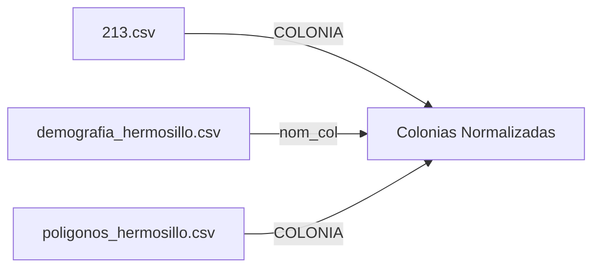

# 📖 Diccionario de Datos
## Proyecto: Índice Delictivo Hermosillo

**Fecha de actualización**: 5 de noviembre de 2025  
**Versión**: 1.0  

---

## 📊 Resumen de Datasets

| Dataset | Archivo | Registros | Columnas | Fuente |
|---------|---------|-----------|----------|--------|
| Reportes 911 | `213.csv` | 349,131 | 4 | Sistema de Emergencias 911 |
| Demografía | `demografia_hermosillo.csv` | 660 | 11 | INEGI Censo 2020 |
| Polígonos | `poligonos_hermosillo.csv` | - | 32 | INEGI Marco Geoestadístico |

---

## 📞 Dataset: Reportes a Servicios de Emergencia (213.csv)

### Descripción General
Registro de incidentes reportados al sistema de emergencias 911 en Hermosillo, Sonora. Contiene información sobre el tipo de incidente, ubicación (colonia), fecha y hora del reporte.

### Estructura del Archivo
- **Formato**: CSV (Comma-Separated Values)
- **Encoding**: UTF-8
- **Separador**: Coma (`,`)
- **Total de registros**: 349,131
- **Período temporal**: 2018-2024 (estimado)

### Columnas

#### 1. COLONIA
- **Tipo**: Texto (String)
- **Descripción**: Nombre de la colonia donde ocurrió el incidente
- **Formato**: MAYÚSCULAS
- **Valores nulos**: No permitidos
- **Observaciones**: 
  - Contiene múltiples variantes ortográficas de la misma colonia
  - 1,407 valores únicos originales
  - 1,267 valores únicos después de normalización
- **Ejemplos**:
  ```
  10 DE MAYO
  QUINTA ESMERALDA
  LÓPEZ PORTILLO
  VILLAS DEL CORTES
  ```

#### 2. TIPO DE INCIDENTE
- **Tipo**: Texto (String)
- **Descripción**: Clasificación del tipo de incidente reportado
- **Formato**: MAYÚSCULAS
- **Valores nulos**: No permitidos
- **Categorías principales**:
  - Delitos contra la seguridad pública
  - Apoyo a la ciudadanía
  - Violencia familiar
  - Delitos contra el patrimonio
  - Incidentes de tránsito
- **Ejemplos**:
  ```
  PORTACIÓN DE ARMAS O CARTUCHOS
  PERSONA AGRESIVA
  APOYO A LA CIUDADANÍA
  ALLANAMIENTO DE MORADA
  VEHÍCULO A EXCESO DE VELOCIDAD
  ```

#### 3. FECHA
- **Tipo**: Fecha (Date)
- **Descripción**: Fecha en que ocurrió el incidente
- **Formato**: `YYYY-MM-DD` (ISO 8601)
- **Valores nulos**: No permitidos
- **Rango**: 2018-01-01 a 2024-12-31 (aproximado)
- **Ejemplos**:
  ```
  2018-07-30
  2018-11-16
  2018-01-29
  2018-03-12
  ```

#### 4. HORA
- **Tipo**: Entero (Integer)
- **Descripción**: Hora del día en que ocurrió el incidente (formato 24 horas)
- **Formato**: Número entero de 0 a 23
- **Valores nulos**: No permitidos
- **Rango**: 0-23 (donde 0 = 00:00-00:59, 23 = 23:00-23:59)
- **Ejemplos**:
  ```
  22  (10:00 PM - 10:59 PM)
  7   (7:00 AM - 7:59 AM)
  9   (9:00 AM - 9:59 AM)
  4   (4:00 AM - 4:59 AM)
  ```

### Calidad de Datos

| Aspecto | Evaluación | Detalle |
|---------|------------|---------|
| Completitud | ⭐⭐⭐⭐ | Pocas columnas faltantes |
| Precisión | ⭐⭐⭐ | Errores ortográficos en COLONIA |
| Consistencia | ⭐⭐⭐ | Múltiples variantes de nombres |
| Actualidad | ⭐⭐⭐⭐ | Datos recientes (hasta 2024) |

### Limitaciones Conocidas
1. **Errores ortográficos**: 140 colonias con variantes (10% del total)
2. **Nombres inconsistentes**: Uso irregular de acentos, espacios y mayúsculas
3. **Precisión geográfica**: Solo indica colonia, no dirección exacta
4. **Granularidad temporal**: Hora redondeada (sin minutos/segundos)

---

## 👥 Dataset: Demografía por Colonia (demografia_hermosillo.csv)

### Descripción General
Información demográfica y socioeconómica de las colonias de Hermosillo, Sonora, basada en el Censo de Población y Vivienda 2020 del INEGI.

### Estructura del Archivo
- **Formato**: CSV (Comma-Separated Values)
- **Encoding**: UTF-8 con BOM
- **Separador**: Coma (`,`)
- **Total de registros**: 660
- **Fuente**: INEGI - Censo de Población y Vivienda 2020

### Columnas

#### 1. nom_loc
- **Tipo**: Texto (String)
- **Descripción**: Nombre de la localidad
- **Valores nulos**: No permitidos
- **Valor predominante**: "Hermosillo" (ciudad)
- **Ejemplo**: `Hermosillo`

#### 2. cve_col
- **Tipo**: Texto (String)
- **Descripción**: Clave única de la colonia según INEGI
- **Formato**: `MMMLLLLLLL` (3 dígitos municipio + 7 dígitos localidad + identificador)
- **Valores nulos**: No permitidos
- **Ejemplo**: `2603000010`

#### 3. nom_col
- **Tipo**: Texto (String)
- **Descripción**: Nombre oficial de la colonia
- **Formato**: MAYÚSCULAS
- **Valores nulos**: No permitidos
- **Valores únicos**: 659 (después de normalización)
- **Calidad**: ⭐⭐⭐⭐⭐ Muy alta (datos oficiales INEGI)
- **Ejemplos**:
  ```
  OASIS LANTANA
  4 DE MARZO
  ACACIAS RESIDENCIAL
  ADOLFO DE LA HUERTA
  ```

#### 4. viviendas_totales
- **Tipo**: Entero (Integer)
- **Descripción**: Número total de viviendas en la colonia
- **Valores nulos**: No permitidos
- **Rango**: 1 - 5,000+ (aproximado)
- **Unidad**: Viviendas
- **Ejemplo**: `211`

#### 5. poblacion_total
- **Tipo**: Entero (Integer)
- **Descripción**: Número total de habitantes en la colonia
- **Valores nulos**: No permitidos
- **Rango**: 1 - 15,000+ (aproximado)
- **Unidad**: Personas
- **Ejemplo**: `650`

#### 6. pctj_mujeres
- **Tipo**: Texto (String) - Porcentaje
- **Descripción**: Porcentaje de población femenina
- **Formato**: `XX.X%` (un decimal + símbolo %)
- **Valores nulos**: No permitidos
- **Rango**: 0.0% - 100.0%
- **Ejemplo**: `50.7%`
- **Nota**: Suma con `pctj_hombres` debe ser ~100%

#### 7. pctj_hombres
- **Tipo**: Texto (String) - Porcentaje
- **Descripción**: Porcentaje de población masculina
- **Formato**: `XX.X%` (un decimal + símbolo %)
- **Valores nulos**: No permitidos
- **Rango**: 0.0% - 100.0%
- **Ejemplo**: `49.3%`
- **Nota**: Suma con `pctj_mujeres` debe ser ~100%

#### 8. pctj_menores18
- **Tipo**: Texto (String) - Porcentaje
- **Descripción**: Porcentaje de población menor de 18 años
- **Formato**: `XX.X%` (un decimal + símbolo %)
- **Valores nulos**: No permitidos
- **Rango**: 0.0% - 100.0%
- **Ejemplo**: `39.2%`

#### 9. pctj_adultos18_59
- **Tipo**: Texto (String) - Porcentaje
- **Descripción**: Porcentaje de población entre 18 y 59 años (edad productiva)
- **Formato**: `XX.X%` (un decimal + símbolo %)
- **Valores nulos**: No permitidos
- **Rango**: 0.0% - 100.0%
- **Ejemplo**: `60.3%`

#### 10. pctj_60ymas
- **Tipo**: Texto (String) - Porcentaje
- **Descripción**: Porcentaje de población de 60 años o más (adultos mayores)
- **Formato**: `XX.X%` (un decimal + símbolo %)
- **Valores nulos**: No permitidos
- **Rango**: 0.0% - 100.0%
- **Ejemplo**: `0.5%`
- **Nota**: La suma de pctj_menores18 + pctj_adultos18_59 + pctj_60ymas debe ser ~100%

#### 11. escolaridad_años_prom
- **Tipo**: Decimal (Float)
- **Descripción**: Promedio de años de escolaridad de la población de 15 años y más
- **Formato**: Número decimal con un dígito
- **Valores nulos**: No permitidos
- **Rango**: 0.0 - 20.0 años
- **Unidad**: Años
- **Ejemplo**: `11.4`
- **Interpretación**:
  - 6 años = Primaria completa
  - 9 años = Secundaria completa
  - 12 años = Bachillerato completo
  - 16 años = Licenciatura completa

#### 12. nivel_escolaridad_prom
- **Tipo**: Texto (String)
- **Descripción**: Nivel educativo promedio alcanzado por la población
- **Valores nulos**: Permitidos
- **Valores posibles**:
  - `Sin escolaridad`
  - `Primaria`
  - `Secundaria`
  - `Preparatoria` / `Bachillerato`
  - `Licenciatura`
  - `Posgrado`
- **Ejemplo**: `Secundaria`

### Calidad de Datos

| Aspecto | Evaluación | Detalle |
|---------|------------|---------|
| Completitud | ⭐⭐⭐⭐⭐ | Datos completos |
| Precisión | ⭐⭐⭐⭐⭐ | Fuente oficial INEGI |
| Consistencia | ⭐⭐⭐⭐⭐ | Estandarización alta |
| Actualidad | ⭐⭐⭐⭐ | Censo 2020 (hace 5 años) |

---

## 🗺️ Dataset: Polígonos Geográficos (poligonos_hermosillo.csv)

### Descripción General
Información geoespacial de las colonias de Hermosillo, incluyendo coordenadas de polígonos, claves geográficas y datos del Índice de Marginación 2020 del CONAPO.

### Estructura del Archivo
- **Formato**: CSV (Comma-Separated Values)
- **Encoding**: UTF-8
- **Separador**: Coma (`,`)
- **Total de registros**: Variable (una fila por colonia)
- **Fuente**: INEGI + CONAPO

### Columnas Principales

#### Identificación Geográfica

##### 1. OBJECTID
- **Tipo**: Entero (Integer)
- **Descripción**: Identificador único del objeto geográfico
- **Valores nulos**: No permitidos
- **Ejemplo**: `78821`

##### 2. CVE_COL
- **Tipo**: Texto (String)
- **Descripción**: Clave de la colonia (formato INEGI)
- **Formato**: `MMMMM_NNNN` (5 dígitos municipio + 4 dígitos secuencial)
- **Ejemplo**: `26030_0001`

##### 3. ID_COL
- **Tipo**: Entero (Integer)
- **Descripción**: ID numérico de la colonia
- **Ejemplo**: `78821`

##### 4. COLONIA
- **Tipo**: Texto (String)
- **Descripción**: Nombre de la colonia
- **Formato**: MAYÚSCULAS, puede incluir acentos
- **Ejemplo**: `14 de Marzo`

##### 5. CP
- **Tipo**: Entero (Integer)
- **Descripción**: Código Postal
- **Formato**: 5 dígitos
- **Ejemplo**: `83287`

#### Ubicación Administrativa

##### 6. CVE_ENT
- **Tipo**: Texto (String)
- **Descripción**: Clave de la entidad federativa
- **Valor**: `26` (Sonora)

##### 7. NOM_ENT
- **Tipo**: Texto (String)
- **Descripción**: Nombre de la entidad federativa
- **Valor**: `Sonora`

##### 8. MUN
- **Tipo**: Texto (String)
- **Descripción**: Nombre del municipio
- **Valor**: `030` (Hermosillo)

##### 9. CVE_MUN
- **Tipo**: Texto (String)
- **Descripción**: Clave del municipio
- **Formato**: `MMMMM` (5 dígitos)
- **Ejemplo**: `26030`

##### 10. NOM_MUN
- **Tipo**: Texto (String)
- **Descripción**: Nombre del municipio
- **Valor**: `Hermosillo`

##### 11. LOC
- **Tipo**: Texto (String)
- **Descripción**: Clave de localidad
- **Ejemplo**: `0001`

##### 12. CVE_LOC
- **Tipo**: Texto (String)
- **Descripción**: Clave completa de localidad
- **Formato**: 9 dígitos
- **Ejemplo**: `260300001`

##### 13. NOM_LOC
- **Tipo**: Texto (String)
- **Descripción**: Nombre de la localidad
- **Valor predominante**: `Hermosillo`

#### Sistema Urbano Nacional

##### 14. SUN_2018
- **Tipo**: Texto (String)
- **Descripción**: Clave del Sistema Urbano Nacional 2018
- **Ejemplo**: `M26.02`

##### 15. NOM_SUN
- **Tipo**: Texto (String)
- **Descripción**: Nombre del Sistema Urbano Nacional
- **Valor**: `Hermosillo`

#### Datos Demográficos

##### 16. POBTOT
- **Tipo**: Decimal (Float)
- **Descripción**: Población total en la colonia
- **Unidad**: Personas
- **Ejemplo**: `51.128994`

#### Indicadores de Carencias Sociales (%)

##### 17. P6A14NAE
- **Tipo**: Decimal (Float)
- **Descripción**: Porcentaje de población de 6 a 14 años que no asiste a la escuela
- **Unidad**: Porcentaje (sin símbolo %)
- **Rango**: 0.0 - 100.0
- **Ejemplo**: `3.492064`

##### 18. SBASC
- **Tipo**: Decimal (Float)
- **Descripción**: Porcentaje de población sin acceso a servicios básicos
- **Unidad**: Porcentaje
- **Ejemplo**: `23.076922`

##### 19. PSDSS
- **Tipo**: Decimal (Float)
- **Descripción**: Porcentaje de población sin derechohabiencia a servicios de salud
- **Unidad**: Porcentaje
- **Ejemplo**: `14.981856`

##### 20. OVSDE
- **Tipo**: Decimal (Float)
- **Descripción**: Porcentaje de viviendas con piso de tierra
- **Unidad**: Porcentaje
- **Ejemplo**: `0.0`

##### 21. OVSEE
- **Tipo**: Decimal (Float)
- **Descripción**: Porcentaje de viviendas sin energía eléctrica
- **Unidad**: Porcentaje
- **Ejemplo**: `0.675676`

##### 22. OVSAE
- **Tipo**: Decimal (Float)
- **Descripción**: Porcentaje de viviendas sin agua entubada
- **Unidad**: Porcentaje
- **Ejemplo**: `0.0`

##### 23. OVPT
- **Tipo**: Decimal (Float)
- **Descripción**: Porcentaje de viviendas con algún nivel de hacinamiento
- **Unidad**: Porcentaje
- **Ejemplo**: `1.507276`

##### 24. OVHAC
- **Tipo**: Decimal (Float)
- **Descripción**: Porcentaje de viviendas con hacinamiento crítico
- **Unidad**: Porcentaje
- **Ejemplo**: `25.0`

##### 25. OVSREF
- **Tipo**: Decimal (Float)
- **Descripción**: Porcentaje de viviendas sin refrigerador
- **Unidad**: Porcentaje
- **Ejemplo**: `2.754678`

##### 26. OVSINT
- **Tipo**: Decimal (Float)
- **Descripción**: Porcentaje de viviendas sin internet
- **Unidad**: Porcentaje
- **Ejemplo**: `42.619543`

##### 27. OVSCEL
- **Tipo**: Decimal (Float)
- **Descripción**: Porcentaje de viviendas sin teléfono celular
- **Unidad**: Porcentaje
- **Ejemplo**: `8.367983`

#### Índice de Marginación 2020 (CONAPO)

##### 28. IM_2020
- **Tipo**: Decimal (Float)
- **Descripción**: Índice de Marginación 2020
- **Rango**: Valores negativos (menor marginación) a positivos (mayor marginación)
- **Ejemplo**: `150.776583930797`
- **Interpretación**: Mayor valor = mayor marginación

##### 29. GM_2020
- **Tipo**: Texto (String)
- **Descripción**: Grado de Marginación 2020
- **Valores posibles**:
  - `Muy bajo`
  - `Bajo`
  - `Medio`
  - `Alto`
  - `Muy alto`
- **Ejemplo**: `Bajo`

##### 30. IMN_2020
- **Tipo**: Decimal (Float)
- **Descripción**: Índice de Marginación Normalizado 2020
- **Rango**: 0.0 - 1.0
- **Ejemplo**: `0.961291266388`
- **Interpretación**: Valor normalizado del IM_2020

#### Clasificación Urbana

##### 31. CLASIF
- **Tipo**: Texto (String)
- **Descripción**: Clasificación del tipo de asentamiento
- **Valores posibles**:
  - `Colonia`
  - `Fraccionamiento`
  - `Unidad habitacional`
  - Otros
- **Ejemplo**: `Fraccionamiento`

#### Información Geoespacial

##### 32. POLIGONO_WKT
- **Tipo**: Texto (String) - Well-Known Text
- **Descripción**: Geometría del polígono que define los límites de la colonia
- **Formato**: WKT (Well-Known Text)
- **Tipo de geometría**: POLYGON
- **Sistema de coordenadas**: WGS84 (latitud/longitud)
- **Ejemplo**:
  ```
  POLYGON ((-110.987904 29.056345, -110.988321 29.057129, ...))
  ```
- **Uso**: Para representación en mapas GIS, análisis espacial

### Calidad de Datos

| Aspecto | Evaluación | Detalle |
|---------|------------|---------|
| Completitud | ⭐⭐⭐⭐⭐ | Datos completos |
| Precisión | ⭐⭐⭐⭐⭐ | Fuente oficial INEGI/CONAPO |
| Consistencia | ⭐⭐⭐⭐⭐ | Estandarización alta |
| Actualidad | ⭐⭐⭐⭐ | Datos 2020 (hace 5 años) |

---

## 🔗 Relaciones Entre Datasets

### Campos de Unión (Keys)



### Tabla de Correspondencia

| Dataset | Campo Clave | Tipo | Normalización Requerida |
|---------|-------------|------|-------------------------|
| 213.csv | COLONIA | String | ✅ Sí (errores ortográficos) |
| demografia_hermosillo.csv | nom_col | String | ⚠️ Mínima (espacios) |
| poligonos_hermosillo.csv | COLONIA | String | ⚠️ Verificar coincidencias |

### Ejemplo de Unión

```python
# Pseudocódigo para unir datasets

# 1. Normalizar nombres de colonias en 213.csv
reportes_limpios = normalizar_colonias(reportes_911)

# 2. Unir con demografía
datos_completos = reportes_limpios.merge(
    demografia,
    left_on='COLONIA_NORMALIZADA',
    right_on='nom_col',
    how='left'
)

# 3. Agregar información geoespacial
datos_finales = datos_completos.merge(
    poligonos,
    left_on='COLONIA_NORMALIZADA',
    right_on='COLONIA',
    how='left'
)
```

---

## 📋 Notas Técnicas

### Encoding y Caracteres Especiales

| Dataset | Encoding Original | Encoding Recomendado | Caracteres Especiales |
|---------|-------------------|----------------------|----------------------|
| 213.csv | UTF-8 | UTF-8 | Acentos, ñ, mayúsculas |
| demografia_hermosillo.csv | UTF-8 BOM | UTF-8 | Acentos, ñ, símbolo % |
| poligonos_hermosillo.csv | UTF-8 | UTF-8 | Acentos, ñ, coordenadas |

### Conversión de Tipos de Datos

```python
# Ejemplo de conversión de tipos en pandas

# 213.csv
df_reportes['FECHA'] = pd.to_datetime(df_reportes['FECHA'])
df_reportes['HORA'] = df_reportes['HORA'].astype(int)

# demografia_hermosillo.csv
df_demo['viviendas_totales'] = df_demo['viviendas_totales'].astype(int)
df_demo['poblacion_total'] = df_demo['poblacion_total'].astype(int)
df_demo['pctj_mujeres'] = df_demo['pctj_mujeres'].str.rstrip('%').astype(float)

# poligonos_hermosillo.csv
df_poli['POBTOT'] = df_poli['POBTOT'].astype(float)
df_poli['CP'] = df_poli['CP'].astype(str).str.zfill(5)
```

---

## 🔍 Casos de Uso Comunes

### 1. Análisis de Incidencia Delictiva por Colonia
```python
incidencias = df_reportes.groupby('COLONIA').size()
top_colonias = incidencias.sort_values(ascending=False).head(10)
```

### 2. Correlación Demografía - Delincuencia
```python
df_merged = df_reportes.merge(df_demografia, 
                               left_on='COLONIA', 
                               right_on='nom_col')
correlacion = df_merged.groupby('nom_col').agg({
    'TIPO DE INCIDENTE': 'count',
    'poblacion_total': 'first'
})
```

### 3. Visualización Geoespacial
```python
import geopandas as gpd
from shapely import wkt

gdf = gpd.GeoDataFrame(
    df_poligonos,
    geometry=df_poligonos['POLIGONO_WKT'].apply(wkt.loads)
)
gdf.plot(column='GM_2020', legend=True)
```

---

## 📚 Referencias

- **INEGI**: Instituto Nacional de Estadística y Geografía
  - Censo de Población y Vivienda 2020
  - Marco Geoestadístico Nacional
  
- **CONAPO**: Consejo Nacional de Población
  - Índice de Marginación por Localidad 2020
  
- **Sistema 911**: Sistema Nacional de Emergencias

---

## 📅 Historial de Versiones

| Versión | Fecha | Cambios |
|---------|-------|---------|
| 1.0 | 2025-11-05 | Creación inicial del diccionario de datos |

---

**Última actualización**: 5 de noviembre de 2025  
**Responsable**: Equipo de Seguridad y Desarrollo  
**Contacto**: [Repositorio GitHub](https://github.com/Equipo-seguridad-y-desarrollo/indice-delictivo-hermosillo)
